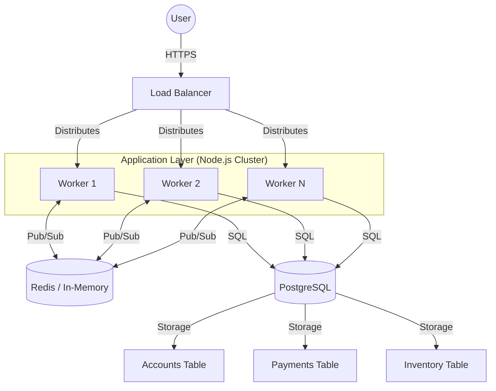

# Soul of Frappe 🍓

## Vision
To provide a seamless, high-performance ticketing experience that remains resilient under the most demanding concurrency levels. Frappe isn't just about selling tickets; it's about ensuring that every fan gets a fair shot at being part of the experience, without the friction of system failures, race conditions, or sold-out frustrations.

## Core Values
- **Reliability**: Every transaction is sacred. We prioritize data integrity above all else.
- **Fairness**: Ensuring first-come, first-served integrity through robust concurrency control and atomic inventory management.
- **Speed**: Minimal latency, from the first click to the final confirmation, leveraging in-memory state where possible.
- **Scalability**: A distributed architecture designed to handle thousands of concurrent requests across multiple CPU cores.

## System Architecture

## Technical Philosophy

### 1. Concurrency & Distributed State
Frappe utilizes a multi-process architecture. To maintain consistency across workers, we use **Redis** as a centralized pub/sub hub and state manager. This allows workers to coordinate real-time updates (like SSE notifications) without being coupled to a single process.

### 2. Atomic Integrity
Inventory management is the heartbeat of the system. We use **PostgreSQL transactions** and atomic `UPDATE` queries to prevent overselling.
- **Locking Strategy**: Row-level locking ensures that two users cannot claim the last ticket simultaneously.
- **ACID Compliance**: Every payment record and inventory shift is guaranteed by the database.

### 3. Idempotency First
In a high-traffic environment, network glitches are inevitable. Frappe implements an **Idempotency Strategy** to ensure that retried requests (e.g., from a user double-clicking or a webhook retry) never result in duplicate charges or multiple inventory deductions.
- Each transaction is tracked by a unique `idempotency_key`.
- The system checks for existing records before processing any payment or inventory logic.

### 4. Real-time Feedback (SSE)
We believe in keeping the user informed. Using **Server-Sent Events (SSE)**, the frontend receives instantaneous updates on payment status changes. This is synchronized across our distributed workers via Redis Pub/Sub, ensuring that no matter which worker the user is connected to, they get their confirmation immediately.

## Future Roadmap
- [ ] **Global Distributed Cache**: Moving from mock-Redis to a managed cluster.
- [ ] **Dynamic Load Scaling**: Automatically spinning up workers based on traffic spikes.
- [ ] **Advanced Rate Limiting**: Protecting the API from bot-driven ticket scalping.
- [ ] **Enhanced Analytics**: Real-time dashboarding for event organizers.

---
*Frappe: The heart of every event.*
