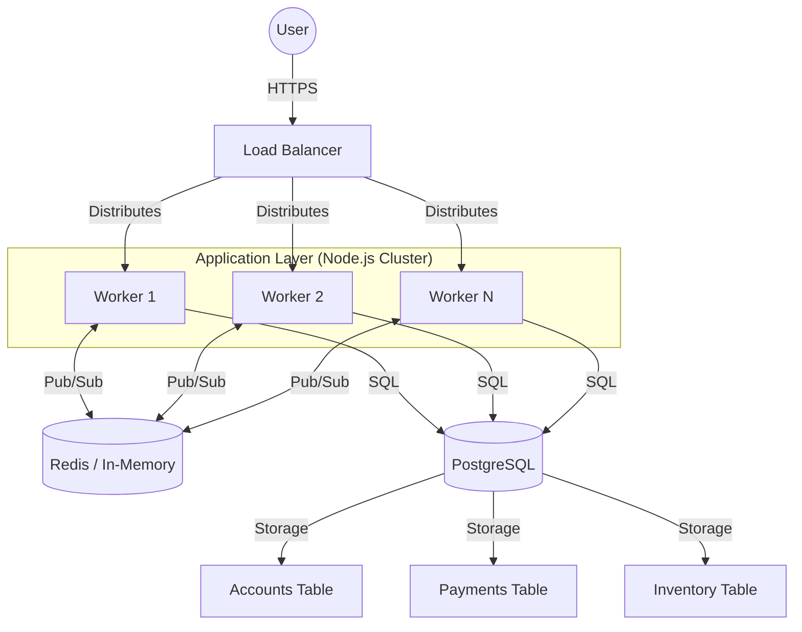

# Soul of Neon Horizon 🍓

## Vision
To provide a seamless, high-performance ticketing experience that remains resilient under the most demanding concurrency levels. Frappe isn't just about selling tickets; it's about ensuring that every fan gets a fair shot at being part of the experience, without the friction of system failures, race conditions, or sold-out frustrations.

## Core Values
- **Reliability**: Every transaction is sacred. We prioritize data integrity above all else.
- **Fairness**: Ensuring first-come, first-served integrity through robust concurrency control and atomic inventory management.
- **Speed**: Minimal latency, from the first click to the final confirmation, leveraging in-memory state where possible.
- **Scalability**: A distributed architecture designed to handle thousands of concurrent requests across multiple CPU cores.

## System Architecture



## Technical Philosophy

### 1. Concurrency & Distributed State
Frappe utilizes a multi-process architecture. To maintain consistency across workers, we use **Redis** as a centralized pub/sub hub and state manager. This allows workers to coordinate real-time updates (like SSE notifications) without being coupled to a single process.

### 2. Atomic Integrity
Inventory management is the heartbeat of the system. We use **PostgreSQL transactions** and atomic `UPDATE` queries to prevent overselling.
- **Locking Strategy**: Row-level locking ensures that two users cannot claim the last ticket simultaneously.
- **ACID Compliance**: Every payment record and inventory shift is guaranteed by the database.

### 3. Idempotency First
In a high-traffic environment, network glitches are inevitable. Frappe implements an **Idempotency Strategy** to ensure that retried requests (e.g., from a user double-clicking or a webhook retry) never result in duplicate charges or multiple inventory deductions.
- Each transaction is tracked by a unique `idempotency_key`.
- The system checks for existing records before processing any payment or inventory logic.

### 4. Real-time Feedback (SSE)
We believe in keeping the user informed. Using **Server-Sent Events (SSE)**, the frontend receives instantaneous updates on payment status changes. This is synchronized across our distributed workers via Redis Pub/Sub, ensuring that no matter which worker the user is connected to, they get their confirmation immediately.

## Production Foundations

### Durable Redis
Set `REDIS_URL` in production. Without it, the app exits instead of silently falling back to the local in-memory Redis mock, because inventory and cross-worker SSE updates must survive restarts and scale across instances.

### Confirmation Email Outbox
Payment completion now creates a durable `email_jobs` record with an idempotency key like `ticket-confirmation:<payment_id>`. The outbox worker claims ready jobs with PostgreSQL row locks, sends the confirmation through `mailer.js`, records the provider message id, and retries failed sends with backoff.

### Weekly Inventory Reset
The ticket pool refills to `INVENTORY_CAPACITY` (default `100`) at the start of each ISO week — Monday 00:00 UTC. The reset is lazy and needs no scheduler: on the first read or reservation of a new week, the first worker to notice claims the rollover with an atomic Redis `GETSET` on `tickets:week` and refills `tickets:available`; the others see the updated stamp and skip it. Restarts within a week keep the current count. Set `INVENTORY_RESET=never` to disable and hold the pool fixed.

### Mailgun setup
Set these environment variables to send confirmation emails through Mailgun:

```bash
MAILGUN_API_KEY=your-mailgun-private-key
MAILGUN_DOMAIN=mg.your-domain.com
MAILGUN_FROM_EMAIL=tickets@mg.your-domain.com
```

Optional:

```bash
MAILGUN_BASE_URL=https://api.mailgun.net
MAILGUN_REGION=us
```

If Mailgun is configured, the app will use it before falling back to Brevo, SendGrid, SMTP, or the development Ethereal inbox.

### Account Passwords
Account signup stores `scrypt` password hashes through Node's built-in crypto module. Login verifies hashes with timing-safe comparison and never compares plain-text passwords.

### Account Sessions
`signup` and `login` now issue an HMAC-signed, stateless session token in an
`HttpOnly` `SameSite=Lax` cookie (`nh_session`, `Secure` in production). Set
`SESSION_SECRET` to a 32-byte random hex string — **production and Vercel
deployments refuse to boot without it** rather than signing sessions with a
shared dev key.

| Route | Purpose |
| --- | --- |
| `POST /api/accounts/signup` | Create account, start session |
| `POST /api/accounts/login` | Verify credentials, start session |
| `POST /api/accounts/logout` | Clear the session cookie |
| `GET /api/accounts/me` | Current account, or `401` |

When a request carries a valid session, `POST /api/payments` links the new
payment to that account via `payments.account_id`.

### CORS
Browsers only enforce CORS for cross-origin calls; the bundled frontend is
same-origin and always works. To let specific external origins call the API with
credentials, set `ALLOWED_ORIGINS` to a comma-separated list. With no allowlist,
any origin is accepted in development and none in production.

### Request Validation
`POST /api/payments` requires a syntactically valid `customerEmail` so the
confirmation is deliverable instead of failing silently. Unknown `/api/*` routes
return a JSON `404` instead of the SPA shell.

### Webhook Authentication
`POST /api/webhook` accepts the shared secret via the `X-Webhook-Secret` header
(preferred) or the legacy `webhook_secret` body field, compared in constant time.

### Real-time Availability
The `/api/availability/status` SSE stream is a best-effort optimisation — it
cannot span serverless function timeouts or multiple workers. The frontend polls
`GET /api/availability` every 20s as the reliable path; the stream just delivers
faster updates when it is available. Tune with `SSE_MAX_LIFETIME_MS` and
`SSE_HEARTBEAT_MS`.

Run database setup after pulling this version:

```bash
npm run db:init
```

For long-running Node deployments, `npm start` starts the email worker with the web server. For serverless deployments, payment completion drains one queued confirmation inline so the persisted outbox still prevents duplicate sends.

## Future Roadmap
- [ ] **Global Distributed Cache**: Moving from mock-Redis to a managed cluster.
- [ ] **Dynamic Load Scaling**: Automatically spinning up workers based on traffic spikes.
- [ ] **Advanced Rate Limiting**: Protecting the API from bot-driven ticket scalping.
- [ ] **Enhanced Analytics**: Real-time dashboarding for event organizers.

---
*Frappe: The heart of every event.*
